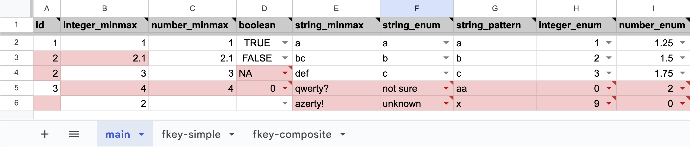

tablecloth: Spreadsheet templates for tabular data entry
========================================================

.. toctree::
   :hidden:
   :maxdepth: 1

   Introduction <self>
   features
   reference

.. toctree::
   :hidden:
   :caption: Appendix

   license
   genindex

|codecov| |tests|

.. |codecov| image:: https://codecov.io/gh/ezwelty/tablecloth/branch/main/graph/badge.svg?token=RP9E7WLFCI
   :target: https://codecov.io/gh/ezwelty/tablecloth

.. |tests| image:: https://github.com/ezwelty/tablecloth/actions/workflows/tests.yaml/badge.svg
   :target: https://github.com/ezwelty/tablecloth/actions/workflows/tests.yaml

*Example Google Sheets template with invalid values highlighted in red.*

Installation
------------

.. code-block:: console

   $ pip install tablecloth[excel,gsheets]

* ``[excel]``: Adds optional support for Microsoft Excel.
* ``[gsheets]``: Adds optional support for Google Sheets.

Usage
-----

First, describe your tabular data using
`Frictionless Data <https://frictionlessdata.io>`_'s
`Tabular Data Package <https://specs.frictionlessdata.io/tabular-data-package>`_ format.
In this format, tables are *resources* and columns are *fields*.

.. code-block:: python

   package = {
      'resources': [{
         'name': 'tree',
         'schema': {
         'fields': [{
            'name': 'id',
            'type': 'integer',
            'constraints': {'required': True, 'unique': True},
         }, {
            'name': 'type',
            'type': 'string',
            'constraints': {'enum': ['deciduous', 'evergreen']},
         }]
         }
      }, {
         'name': 'branch',
         'schema': {
         'foreignKeys': [{
            'fields': ['tree_id'],
            'reference': {'resource': 'tree', 'fields': ['id']},
         }],
         'fields': [{
            'name': 'tree_id',
            'type': 'integer',
         }, {
            'name': 'height',
            'type': 'number',
            'constraints': {'minimum': 0}
         }]
         }
      }]
   }

Then use :func:`tablecloth.excel.write_template` to build a Microsoft Excel template.

.. code-block:: python

   import tablecloth.excel

   tablecloth.excel.write_template(package, path='template.xlsx')

Or use :func:`tablecloth.gsheets.write_template` to build a Google Sheets
template. To do so, first authorize access with :func:`pygsheets.authorize` and
create or open a spreadsheet with the resulting :class:`pygsheets.client.Client` object.

.. code-block:: python

   import pygsheets
   import tablecloth.gsheets

   client = pygsheets.authorize(...)
   book = client.create('template')
   tablecloth.gsheets.write_template(package, book=book)
